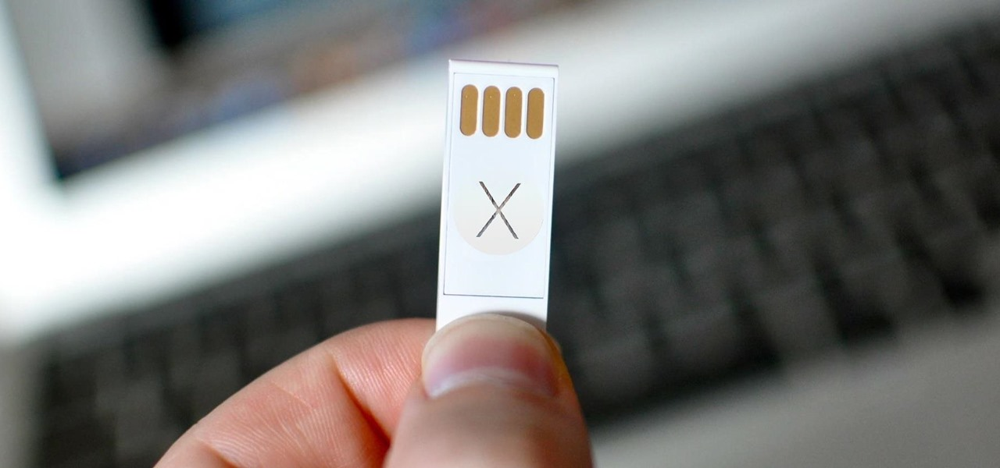

# 🍏 macOS USB Creator

A script that automates creation of a bootable macOS installer on Linux and macOS. 
* Uses **gibMacOS** by corpnewt: https://github.com/corpnewt/gibMacOS
* Inspired by https://github.com/myspaghetti/macos-guest-virtualbox
* Uses only open-source software and downloads unmodified Apple binaries, without closed-source additions or fishy ISO images
* Largely based on this tutorial: https://internet-install.gitbook.io/macos-internet-install/preparing-your-installer.../preparing-your-installer-media...

### Dependencies
* p7zip
* python
* bash
* git

### Usage
```
git clone https://github.com/notthebee/macos_usb
cd macos_usb && bash macos_usb.sh
```
